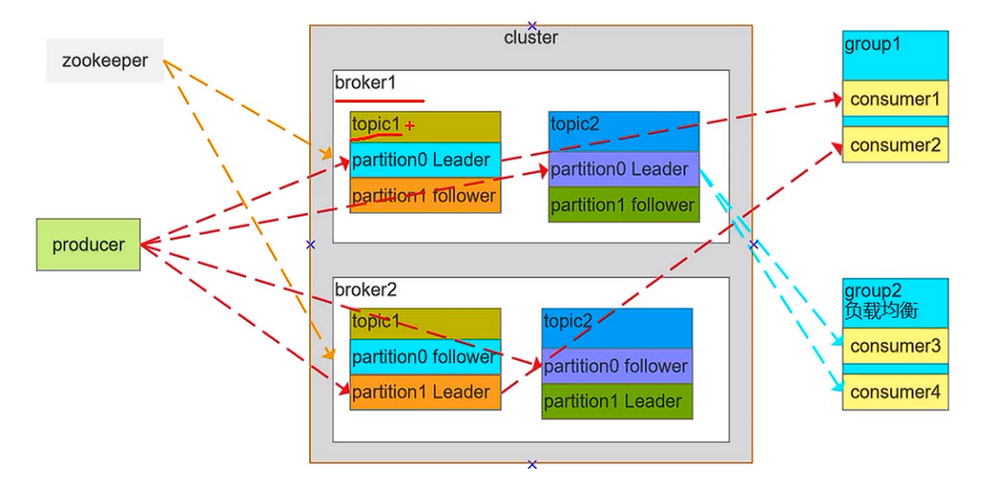

# 网络
## TCP和UDP有什么区别
1. TCP是面向连接的，UDP是无连接的。
2. TCP是可靠的，保证数据的正确性，UDP是不可靠的，可能会丢包。
3. TCP是保证有序的，UDP是无序的。
4. TCP的结构比UDP要复杂。

## TCP怎么保证可靠
1. 校验和。由发送端计算待发送 TCP 报文段的校验和，然后接收端对接收到的 TCP 报文段验证其校验和。
2. 序列号和确认应答机制。TCP 报文段的首部中有一个序号字段,接收方收到 TCP 报文段后就会返回一个确认应答消息。
3. 重传机制。包括超时重传和快速重传。在报文段丢失或ACK丢失都会进行超时重传。而每当接收方收到比期望序号大的失序报文段到达时，就向发送方发送一个冗余 ACK，指明下一个期待字节的序号。
4. 滑动窗口协议。累积确认，发送方的数据保留在缓冲区一段时间，直到收到该报文段的确认应答，或后续报文段的确认应答。发送方和接收方的滑动窗口。
5. 流量控制。根据接收方的缓冲区大小，发送方进行流量控制。
6. 拥塞控制。在出现网络拥塞之后，通过控制拥塞窗口的大小，调节发送方的发送的数据量，以降低网络的拥塞程度。

## 浏览器发送出一个请求到收到响应经历了哪些步骤
1. 浏览器解析用户输入的URL，生成一个HTTP格式的请求。
2. 根据URL域名从本地hosts文件查找映射IP，如果没有就会发送给电脑配置的DNS进行域名解，得到IP地址。
3. 浏览器通过操作系统将请求通过四层协议发送出去。
4. 途径各种路由器、交换机，到达最终服务器。
5. 服务器收到请求后，根据指定端口，传递给绑定端口的应用程序。
6. 例如tomcat接收到请求后，按照http协议进行解析，得到要访问的servlet。
7. 如果是SpringMVC中的DispatcherServlet，则找到对应的Controller方法，得到结果。
8. Tomcat将响应结果封装成HTTP响应的格式，再通过网络发送给浏览器所在的服务器。
9. 浏览器所在的服务器将结果传给浏览器，浏览器进行解析渲染。

## 什么是跨域请求，有什么问题，怎么解决
1. 跨域请求是指浏览器在发起网络请求时，会检查请求所对应的协议、域名、端口是否和当前网页一致，如果不一致，就会进行限制。
2. 目的是为了保证用户信息安全，比如cookie、用户资料不会泄漏到另外的网站。
3. 解决的方法：
    - resp.setHeader("Access-Control-Allow-Origin", "*")，表示可以访问所有网站
    - jsonp方式，基于标签实现，因为有些标签例如 img、iframe、script 可以跨域。
    - 通过后台程序进行访问。

## 什么是RPC
远程方法调用，例如方法A调用其他进程(或远程)的方法B。而HTTP和TCP只是实现远程方法调用的一种协议。


# 操作系统
## 孤儿进程、僵尸进程、守护进程分别是什么
1. 一个父进程退出，而它的一个或多个子进程还在运行，那么那些子进程将成为孤儿进程。孤儿进程将被init进程(进程号为1)所收养，并由init进程对它们完成状态收集工作。由于孤儿进程会被init进程给收养，所以孤儿进程不会对系统造成危害。
2. 一个进程使用fork创建子进程，如果子进程退出，而父进程并没有调用wait或waitpid获取子进程的状态信息，释放其占用资源，那么子进程的进程描述符仍然保存在系统中。这种进程称之为僵尸进程。
3. 守护进程是一种运行在后台的特殊的进程，用于周期性处理某种任务或处理某些特定的事件，对整个系统或某个用户程序提供服务。守护进程的父进程在fork之后就先退出了，因此守护进程也是孤儿进程。


# JAVA

## ArrayList的扩容机制
ArrayList的初始容量为10，在向ArrayList中添加元素时，如果元素个数超过了当前容量，则会自动进行扩容。ArrayList的扩容机制如下：  
1. 当元素个数size达到容量capacity时，ArrayList会将当前容量扩大为原来的1.5倍。
2. 新建一个大容量的数组，并将原数组中的元素全部复制到新数组中，再将新元素添加到新数组末尾。
3. 将新数组设置为ArrayList的内部数组，原数组被垃圾回收。

## ArrayList的扩容系数为什么是1.5倍
数组的扩容仍然是综合考虑时间和空间两个部分，如果每次扩容后的大小都是扩容前的两倍，理论上确实会减少很多的扩容次数，节省了时间上的开销。  
但是由于不清楚后序还将有多少的元素插入，盲目的选择大的扩容系数是不可取的，并且当扩容系数大于等于2的时候，将不能复用此前释放掉的内存，因为此前释放掉的内存一定小于等于将要申请的内存的一半（1,2,4,8,16,32...）。  
而当扩容系数小于2，例如1.5时，已释放的内存、当前内存和将要申请的内存的关系大致如下：

| 扩容次数 | 已释放内存 | 当前内存 | 申请内存 |  
|------|-------|------|------|
| 0    | 0     | 10   | 16   |
| 1    | 10    | 16   | 24   |
| 2    | 26    | 24   | 36   |
| 3    | 50    | 36   | 54   |
| 4    | 86    | 54   | 81   |

那么可以看到，当进行第四次扩容的时候，已释放掉的内存86就已经大于将要申请的内存81，那么就可以复用之前释放掉的内存。  
而释放掉的内存可能还是有JVM管理，而并没有归还给操作系统，因此能节省很大一部分的内存和减少开销。  
而为什么是1.5，是因为可以充分利用位移运算，提高执行效率。

## 线程安全的集合有哪些
1. ConcurrentHashMap：线程安全且效率高的哈希表实现，实现了Map接口。
2. CopyOnWriteArrayList：线程安全的ArrayList，它在写入操作时会复制一份原来的数据，并在复制的数据上进行修改，从而避免并发冲突。
3. CopyOnWriteArraySet：线程安全的Set，它在写入操作时会复制一份原来的数据，并在复制的数据上进行修改，从而避免并发冲突。
4. ConcurrentLinkedDeque：线程安全的队列实现，实现了Deque接口。
5. ConcurrentLinkedQueue：线程安全的队列实现，实现了Queue接口。
6. ConcurrentSkipListMap：线程安全且有序的Map实现，基于跳表数据结构实现。
7. ConcurrentSkipListSet：线程安全且有序的Set实现，基于跳表数据结构实现。
8. 除了以上这些线程安全的集合类之外，也可以通过Collections类的synchronized方法将原生集合转换为线程安全的集合。例如：synchronizedList和synchronizedSet。

## CopyOnWriteArrayList了解多少
CopyOnWriteArrayList 是一个线程安全的 List 集合，它采用的是一种读写分离的策略，通过写时复制（Copy-On-Write）来实现并发访问的。在每次写操作时，都会加ReentrantLock，并创建一个新的数组，数组长度为原数组大小加1，从而实现并发的写操作，而读操作不需要锁定，因为不会发生数据的修改，最后再将修改后的新数据替换原始数据。  
因为 CopyOnWriteArrayList 的实现是通过复制原有数组的方式，因此有较高的空间复杂度，因此适用于读远多于写的场景。同时，它也不适用于实时性要求高的场景，因为写操作的延迟比较大。  
需要注意的是，虽然 CopyOnWriteArrayList 是线程安全的，但是它并不保证元素的实时性。

## List的快速失败(fail-fast)和安全失败(fail-safe)了解多少
List 的快速失败（fail-fast）和安全失败（fail-safe）都是针对多线程并发访问的问题。  
快速失败是指在集合发生并发修改时，通过抛出“并发修改异常”来提醒其它线程停止对集合进行访问和修改，以避免数据不一致的问题。ArrayList 和 LinkedList 等集合都是快速失败的实现。  
相反，安全失败是指在集合发生并发修改时，不会抛出异常，而是集合会对当前进行操作的那一份数据持有副本，并以这份副本为基础进行修改操作，而其他线程读取到的是之前的旧数据，这就是所谓的安全失败。这样，即使其它线程进行了修改操作，也不会影响到当前操作的对象。例如，CopyOnWriteArrayList 就是一种线程安全的集合，它的遍历操作是安全失败的实现。

## 谈一下HashMap的数据结构
HashMap用于存储键值对。HashMap的底层数据结构是数组和链表（在新版Java中加入了红黑树），当链表的长度超过8之后，会转换为红黑树，低于这个数会转换为链表。  
当一个键（key）被插入HashMap时，它被哈希（hash）为一个整数，并且被映射到数组索引上。如果在该索引处已经有一个键值对存在了，那么这个新的键值对将通过链表或红黑树添加到该位置。如果索引处没有其他键值对存在，则插入直接完成。  
当获取键对应的值时，HashMap也是将键哈希为一个整数，并使用该整数查找对应的数组索引，如果索引处存在键值对，则通过链表或红黑树查找该键的值。如果没有发现键，就返回null。

## HashMap的hash函数是怎么设计的
1. 将key的hashcode与它自己无符号右移 16 位（即 >>> 16）后的值进行异或。  
2. 将上一步中得到的值与hash表的长度取模，计算出index。  
3. 通过这样的哈希函数设计，既考虑了哈希码值的高位和低位，又充分利用了异或操作和取模运算的高效性，从而使得在分布散列场景下，HashMap 能够更加均衡地将元素分布到各个桶中，以此来提高查询效率。

## 为什么hash表的容量是2的倍数
1. 使用hash % length这样的除法做取模运算的效率很低，而采用 hash & (length - 1) 的方式进行取模运算的效率更高。 
2. 当length为2的倍数是，length - 1为 n 个 1，在做hash的时候将会考虑到hashcode的整个低位，能有效的减少冲突，并且这时的结果与使用%一致。
3. 方便在扩容的时候，重新散列的数据和原来所在的桶有一定的规律。

## 解决hash冲突的方法有哪些
1. 使用链表。
2. 在当前冲突的位置，通过线性探测、二次探测函数，找到下一个空的桶。
3. 再哈希，使用不同的hash函数重新进行hash。

## 为什么hashmap链表转红黑树的阈值为8
1. 时间复杂度考虑：当哈希表中链表长度达到一定的长度时，继续使用链表会导致时间复杂度的线性增长。使用红黑树，当树的高度为n时，只需要n+3左右的操作即可完成插入。对于8个节点，3-4层的红黑树而言，使用链表和红黑树的性能相当，但随着节点增多，使用红黑树的效率将明显提高。
2. 空间占用考虑：红黑树会占用更多额外的内存，当节点较少时，插入的性能与链表相当，但会消耗更多的内存。

## HashMap在多线程的情况下会有什么问题
数据丢失：在HashMap的put操作中，如果两个线程同时调用put方法，可能会导致数据的覆盖，出现数据丢失的问题。

## hashmap的扩容机制
当hashmap的容量超过例如75%时会发生扩容：  
1. 创建一个新的数组，其大小是原数组的两倍。
2. 将原数组中的元素重新分配到新数组中。JDK1.7使用for循环嵌套遍历数组和链表，JDK1.8需要考虑红黑树的场景，可能将红黑树拆分成链表。
3. 将新数组设置为HashMap中的数组。这样，HashMap现在使用的就是新数组。原数组将被垃圾回收机制回收，释放在原数组中使用的空间。

## ConcurrentHashMap的扩容机制
1. JDK1.7中的ConcurrentHashMap基于分段实现，因此扩容是仅对需要的Segment进行扩容。
2. JDK1.8中，ConcurrentHashMap会创建一个2倍长度的数组，然后基于分段，使用多线程进行扩容。

## HashMap和HashTable有什么区别
1. 线程安全性：Hashtable 是线程安全的，而 HashMap 的线程安全要靠在多线程环境下合理的同步方式来保证，否则会存在并发问题。
2. 空值（null）处理：Hashtable 中不允许出现 null 键和 null 值，如果试图添加一个 null 键或值，将会抛出 NullPointerException 异常；而 HashMap 中则可以存储一个 null 键和多个 null 值。
3. 初始容量和扩容方式：Hashtable 的初始容量为 11，负载因子为 0.75。HashMap 的默认初始容量为 16，负载因子为 0.75。在数据量增长的过程中，二者扩容方式也不同，Hashtable 每次扩容通常增大到原来容量的两倍，而 HashMap 每次扩容通常增大到原来容量的两倍，并将容量扩大到大于所需的容量的最小2的幂次。

## 从分段锁和CAS的角度说一下ConcurrentHashMap的实现
1. 分段锁  
    ConcurrentHashMap将整个哈希表分成了多个子段，每个子段都拥有自己的锁Segment，这样在进行操作时，只需要获得该子段的锁，而不需要对整个哈希表进行加锁，从而提高了并发性能。
2. CAS  
    当多个线程需要更新同一个位置的数据时，可以使用CAS来判断该位置的数据是否已经被其他线程修改，如果没有被修改，则可以更新该位置的数据；如果被修改了，则会失败并重新尝试。  
    具体来说，通过使用CAS操作比较当前bucket的value字段的值是否和期望的值相等，如果相等则表示该位置的数据没有被其他线程修改，即可以进行修改操作，这是一个原子操作。

## hashCode()与equals()之间的关系
1. 如果两个对象的hashCode不相同，那么一定不是同一个对象
2. 如果两个对象的hashCode相同，那么不一定是同一个对象
3. 在map里面，先判断hashCode是否相同，再去调用equals判断对象相同，因此重写了equals方法，一定要以相关联的规则重写hashcode。

## 泛型中extends和super的区别
1. <? extends T> 必须是T的子类
2. <? super S> 必须是S的父类

## 如何不改变String对象的引用，改变String的值
因为String对象存的是char[]，因此，可以通过反射的方式改变char[]，从而达到目的。

 

# JVM
## Java对象的创建步骤
1. 在进行对象创建前，JVM会检查该对象所属的类是否已经被加载到内存中。如果没有被加载，JVM会根据类的完整限定名（包名+类名）在磁盘上查找该类的字节码文件，并读取该文件内容到内存中进行解析、装载。
2. 验证类：在类被装载后，JVM会对该类的字节码进行验证，目的是保证字节码的正确性和安全性。验证包括检查字节码格式、语义、安全等方面。
3. 分配内存：JVM会尝试为该类分配一块连续的内存空间，用来存储这个对象的实例变量数据。并为对象实例变量赋初始值。这里所说的赋初始值是指分配内存时，JVM会为对象的各个实例变量分配一块内存空间，并会根据变量类型赋予相应的默认值。例如，对于整型变量，JVM会为其分配4个字节的内存空间，并把这个区域内的所有比特位都设为0。
4. 执行构造方法：JVM会调用类的构造方法来执行对象的初始化。如果没有明确定义构造方法，则会调用默认的构造方法。在构造方法执行完成后，对象就被创建并可以被使用了。
5. JVM返回对象的引用给程序员，程序员可以使用这个引用来访问和操作该对象。

## JVM里new对象的时候，堆会发生抢占吗
JVM在进行对象的分配时，如果有多个线程同时请求分配内存，JVM会通过线程安全的方式保证对象在堆中的正确分配。具体来说，JVM采用的是指针碰撞和空闲列表两种方式进行内存的分配，以及CAS（Compare-And-Swap）等算法保证了线程安全，避免了内存的抢占。因此，在JVM中new对象的时候，堆不会发生抢占。

## 什么是指针碰撞？什么是空闲列表？
当一个程序需要动态地分配内存空间时，可以使用指针碰撞技术或者空闲列表技术来管理内存。两者的主要区别在于如何跟踪内存块的空闲情况。
1. 指针碰撞技术使用指针来跟踪内存块，当需要分配内存时，从当前指针指向的内存位置开始往上分配；当需要释放内存时，指针往下移动，释放空闲内存块。指针碰撞技术仅适用于内存分配连续的情况下，不适用于非连续内存分配的情况。
2. 空闲列表技术维护一个空闲内存块的链表，每当需要分配内存时，就在该链表上查找可用内存块，然后从中取出一块分配给程序使用。而当程序释放内存时，就将释放的内存块加入到空闲内存块的链表中，以备将来再次使用。

## 对象的内存布局
当Java程序创建对象时，JVM会在堆上为该对象分配一块连续的内存，这块内存可以被划分成三部分：对象头、实例数据和对齐填充。
1. 对象头：用于存储一些对象的运行时数据，每个对象头占用的空间为8个字节，存储了例如对象是否可达的标记、锁信息、指向类元数据信息的指针等。
2. 实例数据：它是对象的主要数据，包含了对象的所有非静态属性值，按照从父类到子类的顺序，按照属性在类里定义的顺序，如果是一个基本数据类型，就按照数据的大小分配空间，如果是一个引用类型就分配一个指针大小的空间来存放引用地址，指向具体的对象的实例。
3. 对齐填充：为了保证对象在内存中的地址是8字节的整数倍，在实例数据结束后，可能需要插入一些填充数据来对齐。

## 对象怎么访问定位
1. 将 Java 程序中获取到的对象引用压入 Java 虚拟机栈。
2. 从对象头中获取类型指针，它指向对象所属类的元数据信息的指针，并将该指针存放在寄存器中。
3. 使用类型指针找到对象所属类的元数据信息，即类对象（Class Object）。
4. 从类对象中获取对象变量偏移量，即需要访问的实例变量在对象内存布局中的位置。
5. 根据对象的起始地址和实例变量的偏移量定位到具体的实例变量所在的内存地址，然后操作这个内存地址。

## 请说一下JVM的内存区域
1. 程序计数器（Program Counter Register）：用于指示当前线程执行的字节码指令的地址，是线程私有的。
2. Java虚拟机栈（Java Virtual Machine Stacks）：每个虚拟机栈的生命周期都与一个线程相同，虚拟机栈是线程用来执行方法的内存区域，后进先出，一个线程在执行方法时，每调用一个方法，就是将该方法作为栈帧压入自己的虚拟机栈；方法里调用另一个方法，就是将另一个方法的栈帧再压入虚拟机栈；线程当前执行的方法就是栈顶帧。每一个栈帧对应一个方法。栈帧存储了局部变量表、操作栈、动态连接、方法返回地址。  
    - 局部变量表：对应方法参数与局部变量，其类型是Java的8种基本数据类型加上对象引用。注意是对象的引用，不是对象本身。
    - 操作栈：线程执行方法内部字节码操作指令时使用的后入先出栈，各种指令会往操作栈中写入和提取信息。Java虚拟机的解释执行引擎被称为“基于栈的执行引擎”,里面的“栈”就是操作栈。操作数栈的深度是所有方法中，最大的操作数。
    - 动态连接：每个栈帧都包含一个指向运行时常量池中该栈帧所属方法的引用，栈帧持有这个引用是为了支持方法调用过程中的动态连接，即，调用一个方法是通过该引用找到运行时常量池中的方法信息的。
    - 方法返回地址：方法执行结束，不管是正常退出还是异常退出，都需要返回到该方法被调用的位置。
3. 本地方法栈（Native Method Stack）：与Java虚拟机栈类似，但是用于执行本地方法（Native Method）。
4. Java堆（Java Heap）：用于存储对象实例、数组等信息，是所有线程共享的内存区域。
5. 方法区（Method Area）：用于存储已被虚拟机加载的类信息、常量、静态变量、即时编译器编译后的代码缓存等数据。在Java8之前，HotSpot虚拟机将方法区实现为永久代，能够通过分代收集的GC来管理其内存区域。但这种设计导致Java应用经常遇到内存溢出问题，很多JVM都需要在启动时添加参数-XX:MaxPermSize来调整永久代的大小。因此在Java7的时候，就先将方法区中的字符串常量池、静态变量等转移到了Java堆中；而到了Java8，就直接移除了永久代，将其中剩下的内容如类的元信息、方法元信息、class常量池(字面量和符号引用)、运行时常量池(在运行期间会导入class常量池等地方的内容)等移动到了一个新的区域Metaspace元数据区，将JIT即时编译的代码缓存放到了CodeCache区域。

## JDK1.8里面，为什么使用元空间替代永久代作为方法区的实现
1. 永久代的大小无法动态调整，可能会出现OOM。元空间使用本地内存，容量可以根据初始容量、最大容量、闲置最小比例、闲置最大比例来动态调整元空间大小。
2. 永久的的垃圾回收基于标记清除算法，垃圾回收过程非常复杂，可能会频繁Full GC。元空间垃圾回收时，可以使用 G1 GC 算法进行优化，因为 G1 算法已经被用于管理堆内存，因此使用相同的算法来管理元空间更高效。

##  Java堆具体是怎么分区的
1. 年轻代：分为一个Eden区和两个Survivor区，默认比例大致是8:1:1。大部分新对象都会被分配到Eden区。当Eden区满时，这些对象中的一部分会被移动到Survivor区（其中一个为From区，一个为To区），这些对象经过一段时间后如果仍然存活，则会被移动到老年代中。
2. 老年代：存储一些年龄比较大的对象，这些对象由于生命周期比较长，不容易被垃圾回收器回收。

## 如何判断对象是否存活
1. 引用计数算法：在对象中添加一个引用计数器；每当被引用时，计数器就加1；每当失去一个引用时，计数器就减1；只要计数器为零，该对象就不能再被使用。虽然思路简单，但实现起来有很多例外场景，需要很多额外处理。比如对象之间的循环引用。
2. 可达性分析算法：从一些被称为GC Roots的根对象出发，根据引用关系向下推导可以到达的对象，形成引用链。如果某个对象与GC Roots之间没有任何引用链相连，就认为从GC Roots到该对象是不可达的。不可达的对象即不可能再被使用，是可以被回收的对象。可达性分析算法可以轻松解决循环引用的问题。

## Young GC和Full GC分别什么情况下触发
### Young GC 触发的情况：
1. Eden 区域内存不足时，会触发 Young GC 进行内存清理，通常会把 Eden 区中存活的对象复制到 Survivor 区中。
2. Survivor 区内存不足时，也会触发 Young GC。当其中一个 Survivor 区被占满时，触发 Young GC，并把存活的对象复制到另一个Survivor区。目的是回收内存碎片。
### Full GC触发的情况：
1. Old 区空间不足，无法为新对象分配内存，此时会进行 Full GC。
2. 过多的空间碎片导致系统无法找到足够的连续内存空间，从而触发 Full GC 进行内存整理和回收。

## Java 中可以作为GC Roots的对象有哪几种
有些对象被视为 GC Roots，因为它们无法通过其他对象到达。垃圾回收器从这些对象开始跟踪并标记所有可达对象，剩下的就是无法访问的对象，即垃圾，然后清理并回收它们的空间。  
1. 虚拟机栈中，栈帧中的方法参数、局部变量的引用对象。
2. 本地方法栈中，JNI引用的对象。
3. 方法区中的静态变量和常量引用对象。
4. 其他基本类型（integer，long，float，double等）和系统类对象，如系统类加载器，方法集等。

## 什么是Stop The World
“Stop The World”（STW）是一个垃圾回收器的行为概念，即在垃圾回收器执行垃圾回收操作期间暂停了应用程序所有的线程，以便进行垃圾回收操作。在这段时间内，应用程序无法进行任何操作，包括响应用户请求，导致应用程序出现暂停。  
这种行为通常出现在年轻代垃圾回收、Full GC以及CMS收集器的垃圾回收阶段。由于STW的存在，当应用需要进行大量垃圾回收操作时，应用的性能将会受到影响，因为应用程序需要等待垃圾回收器完成其操作，才能继续进行下一步操作。

## 对象什么时候会进入老年代
1. 对象在Eden和Survivor区经历了一定次数的垃圾回收后，会被移动到老年代，这个阈值默认是15。
2. 无法在新生代分配合适内存的大对象在创建的时候，就被放入老年代。

## 简述一下分代收集理论
分代收集理论建立在三个经验假设之上：
1. 弱分代假说：绝大多数对象都是朝生夕灭的，生命周期很短。
2. 强分代假说：熬过越多次垃圾收集过程(多次可达性分析均可达)的对象就越难以消亡。
3. 跨代引用假说：跨代引用相对于同代引用来说占比极小。  

前两个假说奠定了分代收集的理论基础：垃圾收集器应该将Java堆划分为不同的区域，并根据其年龄(对象熬过垃圾收集的次数)分配到不同的区域。这样对于比较年轻的区域，GC更加频繁，因为可以回收更多的内存空间；而对于较老的区域，因为难以消亡，GC频率就会较低。这种分代收集理论可以兼顾垃圾收集的时间开销和内存利用率。
但只有前两个假说会带来一个问题：当单独对一个区域比如新生代进行垃圾收集时，由于新生代的对象有可能被老年代的对象所引用，因此需要在GC Roots中添加所有老年代的对象。反过来一样，对老年代进行垃圾收集时，需要将新生代的对象加入GC Roots。毫无疑问的是，将关联区域的所有对象加入GC Roots会给垃圾收集带来很大的性能负担。因此又有了上面的第三个假说。根据第三个假说，跨代引用比较少，只用在新生代建立一个全局的数据集，将老年代划分为若干小块，标识哪些块上存在跨代引用；当新生代GC时，不用将老年代的所有对象都加入GC Roots，只需要将有跨代引用的块加入即可。当然，这种方法需要在对象引用关系创建或改变时同时维护这个全局数据集，增加了部分性能开销，但相比将整个老年代加入GC Roots进行可达性分析来说，还是很划算的。

##  简述一下部分收集和整堆收集
1. 部分收集：Partial GC，指仅对部分分代区域进行的垃圾收集，它又可以分为新生代收集，老年代收集和混合收集。
    - 新生代收集，Minor GC或Young GC，针对新生代的垃圾收集。
    - 老年代收集，Major GC或Old GC，针对老年代的垃圾收集。(Major GC 有时也指整堆收集Full GC。)
    - 混合收集，Mixed GC，目标是收集整个新生代以及部分老年代的垃圾收集。目前只有G1收集器会有这种行为。
2. 整堆收集，Full GC，针对整个Java堆个方法区的垃圾收集。

## 垃圾收集算法有哪些
1. 标记-清除算法 (Mark-Sweep)：首先标记所有活动对象，然后清除未标记对象，存在碎片问题。
2. 复制算法 (Copying)：将内存分成两块，每次只使用其中一块，当使用完后，将还存活的对象复制到另一块内存中，然后清除整块内存，不存在碎片问题，但需要额外的空间来复制对象。主要针对新生代存活的对象属于少数，因此标记-复制的就少，同时复制的时候也顺便清理了内存碎片
3. 标记-压缩算法 (Mark-Compact)：标记所有活动对象，然后将它们移到内存的一端，然后清除端之外的所有对象，现代JVM的默认收集算法之一。
4. 分代收集算法 (Generational)：根据对象的年龄将堆划分为不同的区域，一般是年轻代和老年代，两个区域使用不同的垃圾收集算法，适应不同对象的生命周期特点。常用的有Parallel Scavenge算法和CMS算法。

## 垃圾收集器有哪些，适用于什么场景
1. Serial收集器：Serial收集器采用标记复制算法对新生代进行垃圾收集。Serial收集器是最基础的收集器，虽然简单且STW时间相对较长，但在单核或内存受限的环境下，反而是很高效的一个垃圾收集器。例如一个只分配了单核CPU和较小内存(1G以内)的虚拟机上运行的客户端模式的JVM，就很适合使用Serial收集器。
2. ParNew收集器：ParNew就是Serial的GC多线程并行版本。G1成熟之前，主流的Java服务都会采用ParNew + CMS组合作为垃圾收集策略。之所以新生代用ParNew其实是由于实现框架的原因，目前只有ParNew能和CMS配合使用。如果老年代不使用CMS的话，那就也不会使用ParNew作为新生代垃圾收集器。但在CPU单核场景下，由于线程切换，性能就不如Serial收集器了。
3. Parallel Scavenge：新生代收集器，与ParNew在执行时基本相同，同样是基于标记复制算法实现，同样是并行收集。它与ParNew的不同之处在于：能够通过参数控制JVM吞吐量；具备自适应调节策略，把内存管理的调优任务交给虚拟机自己完成；由于底层框架不同的原因，导致不能和CMS配合使用。
4. Serial Old：是Serial收集器的老年代版本，采用标记整理算法，同样是单线程收集。
5. CMS收集器：是JVM中最初采用的一种并发垃圾收集器，采用了标记-清除算法，主要对老年代进行垃圾回收，目标明确、收集范围小，并且不整理内存空间，因此收集时间较短。但是由于内存碎片较多，使得JVM的内存分配变得复杂，会降低吞吐量，因此适用于响应速度较高的低延迟、低卡顿应用场景。
6. Parallel Old：是Parallel Scavenge的老年代版本，支持GC多线程并行收集，基于标记整理算法，由于整理了内存碎片，会造成更多更久的STW，因此适用于高吞吐量的场景，不适用于低延迟、低卡顿的场景。在注重JVM吞吐量，后台运算较多而与用户交互较少的业务场景中，比较适合使用Parallel Scavenge + Parallel Old的组合
7. G1收集器：是一款以Region(区域)为最小内存回收单位的，逻辑上采用分代收集理论的垃圾收集器。

## 简单说一下CMS收集器的垃圾收集过程
1. 初始标记阶段：停止所有应用线程，执行短暂的暂停操作。在这个阶段，只标记与GC Roots相关的对象，完成后继续执行应用程序。GcRoots枚举带来的停顿是很短暂且固定的，不会随着Java堆内存容量的增加而上升。
2. 并发标记阶段：在应用程序继续运行的同时，开始对所有剩余对象进行标记。符合条件的对象标记完成，不符合条件的对象被放入回收集。引用链推导的耗时是不固定的，所以采用并发的方式进行，但并发标记可能会带来对象消失的问题。
3. 重新标记阶段：当并发标记阶段结束后，暂停应用程序，执行一次短暂的重新标记操作，以便标记在并发标记阶段期间新创建或修改的对象。
    - 增量更新：当黑色对象插入新的指向白色对象的引用关系时，就将这个新插入的引用记录下来，等并发扫描结束之后，再将这些记录过的引用关系中的黑色对象为根，重新扫描一次。
    - 原始快照：当灰色对象要删除指向白色对象的引用关系时，就将这个要删除的引用记录下来，在并发扫描结束之后，再将这些记录过的引用关系中的灰色对象为根，重新扫描一次。
    - 原始快照可能会导致实际只被删除引用没有被其他黑色对象新增引用的对象保留下来，成为浮动垃圾，要等到下次GC时再做可达性分析时才会被标记为白色。而增量更新没有这样的问题，但增量更新的效率没有原始快照高。
4. 并发清除阶段：并发清除阶段开始时，将所有未被标记的对象（即垃圾）放入回收集，并在完成时释放相应的空间。此操作是与应用程序同时进行的。

## 有了CMS收集器，为什么还要引入G1收集器
1. 与CMS的“标记-清除”算法不同，G1从整体来看是基于“标记-整理”算法实现的收集器，意味着G1运作期间产生内存空间碎片要少得多，垃圾收集完成之后能提供更多规整的可用内存。这种特性有利于程序长时间运行，在程序为大对象分配内存时不容易因无法找到连续内存空间而提前触发下一次GC。
2. G1是通过停顿预测模型计算出来的历史数据来预测本次收集需要选择的Region数量，从而尽量满足用户设定的目标停顿时间，因此即使使用了标记整理算法，仍然能做到比CMS更少的STW。
3. G1垃圾收集器按回收价值动态确定回收集，使得老年代的回收更加高效。

## G1收集器的Region是什么概念，还存在年轻代和老年代的说法吗
在使用G1垃圾收集器时，仍然使用分代收集理论，但再也不是物理上将堆内存划分为连续分配的新生代和老年代，而是变成了逻辑上的、物理不连续的逻辑分代。但是，与传统的垃圾收集器（如CMS）不同的是，G1将堆空间划分为多个大小相等的区域（Region），每个区域都可能被定义为年轻代或老年代。当垃圾收集器运行时，G1会选择垃圾最多的区域进行垃圾回收，并将该区域中存活的对象复制到其他空闲区域中，以回收该区域的空间，而不是像传统的年轻代和老年代的垃圾收集器一样只对年轻代或老年代进行垃圾回收。因此，G1垃圾收集器被认为是一种基于区域的垃圾收集器，它仍然将堆空间逻辑上分为年轻代和老年代，但更注重区域之间垃圾分布的平衡。

## 几个常见的JVM配置参数
1. -Xms: 设置JVM的初始堆内存大小
2. -Xmx: 设置JVM的最大堆内存大小
3. -Xmn: 设置JVM的年轻代内存大小
4. -Xss: 设置JVM的线程栈大小

## 项目如何排查JVM问题
1. 使用jmap查看JVM中各个区域的使用情况
    - jmap -heap pid 查看使用的垃圾收集器、堆配置信息、使用情况
    - jmap -histo pid 查看对象数量、占用内存大小、类的全限定名
    - -dump:live,format=b,file=xxx pid dump内存快照
2. 使用 jstack pid 命令查看线程的运行情况，比如阻塞、死锁
3. 使用 jstat -gcxxx pid 查看垃圾回收情况，特别是fullgc比较频繁，就需要调优了，可能是对象太大不能放到年轻代？

## 类加载器的双亲委派模型
1. 启动类加载器：Bootstrap ClassLoader,加载jdk中lib目录下的核心类
2. 类扩展加载器：Extension ClassLoader,加载jdk中lib/ext目录的类
3. 应用程序加载器：Application ClassLoader,加载自己写的class类
4. 自定义加载器：自己实现，根据自己的需求自定义加载类
5. 双亲委派机制  
   子加载器会先调用父加载器，如果父类没找到才会去子类加载器接着找，直到最后，如果都没有就会报错：ClassNotFoundException。

## Tomcat中为什么要使用自定义类加载器
一个Tomcat中可以部署多个应用，而每个应用中都存在很多类，因此他们的全限定名有可能是相同的。Tomcat不管部署了多少个应用，他都是一个JVM，如果使用默认的AppClassLoader，就可能存在因为全限定名一致，导致的类冲突的问题。因此Tomcat会给每个应用生成一个WebAppClassLoader。

## Tomcat如何进行优化 // TODO
1. Tomcat可以按照JVM的调优方式进行调优。
2. Tomcat中设计了一些缓冲区，比如appReadBufSize、bufferPoolSize等缓冲区来提高吞吐量。
3. 调整Tomcat的核心线程数、最大线程数。
4. 调整IO模型，使用NIO而不是BIO。


# 多线程和并发
## 并发和并行有什么区别
1. 并发是指两个或多个线程在一段时间内不断地进行交替执行，在逻辑上是同时执行的状态，但在物理上不可能同时运行。
2. 并行是指在同一时刻，多个处理器或多核处理器场景下，多个线程会同时执行不同的任务。

## 什么是死锁，死锁是怎么产生的，如何预防和避免死锁
1. 死锁是两个或多个线程由于竞争资源、相互等待而永远被阻塞的情况。
2. 死锁的必要条件:  
   a. 互斥：资源必须是非共享的，即一个进程占用了该资源，那么另外一个进程只能在该资源被释放之后再申请。  
   b. 占有并等待：—个进程应占有至少一个资源，并等待另一个资源，而该资源为其他进程所占有。  
   c. 非抢占：资源不能被抢占，即资源只能被进程在完成任务后自愿释放。  
   d. 循环等待。
3. 预防死锁的办法：  
   a. 破坏占有并等待条件：进程在运行开始前申请需要的所有资源，但是可能会因资源不满足而无法启动。  
   b. 破坏不可抢占条件：当一个已经持有了一些资源的进程在提出新的资源请求没有得到满足时，它必须释放已经保持的所有资源，待以后需要使用的时候再重新申请。  
   c. 破坏循环等待条件：将资源编号，并且必须按照一定的顺序进行申请。
4. 避免死锁的办法：利用额外的检验信息，在分配资源时判断是否会出现死锁，只在不会出现死锁的情况下才分配资源。

## 线程和进程的区别
进程是操作系统资源分配的基本单位，是程序在执行时运行的实例，包括代码、数据和执行状态等。而线程是进程中的一个执行单元，是操作系统调度和执行的基本单位，是比进程更小的可调度单元，实现了程序的并发执行。

## 什么是线程的饥饿
其中某些线程被系统长时间地忽略，不能获得执行所需的资源或CPU时间，从而无法进行有意义的进展或完成其任务，或者在执行并完成其任务的时候，已经没有意义了。

## 线程常用的操作方法有哪些
start、stop、wait/notify、sleep、join、yield、interrupt

## 线程有几种状态
1. 新建状态（New）：当线程被创建时，进入新建状态。
2. 就绪状态（Ready）：指线程具备了运行的条件，正在等待系统分配处理器资源，一旦获得处理器资源就可以进入运行状态。
3. 运行状态（Running）：线程占用处理器资源，正在执行代码。
4. 阻塞状态（Blocked）：线程被阻塞，不能继续运行，需要等待某些条件满足才能进入就绪状态。
5. 等待状态（Waiting）：线程执行wait()方法等待唤醒通知，进入等待状态。
6. 计时等待状态（Timed Waiting）：线程执行sleep()方法等待一定时间后自动唤醒，进入计时等待状态。
7. 终止状态（Terminated）：线程执行完毕后，进入终止状态。

## 线程间的通讯方式有哪些
线程间可以通过共享变量、管道、阻塞队列、信号量、countDownLatch、CyclicBarrier来实现通信

## 线程有哪些常用的调度方法
1. 抢占式调度：系统根据一定的优先级和时间片轮流让各个线程运行，如果时间片用完了，系统会暂停该线程，让其他线程运行，直到下一次该线程被调度运行。
2. 协同式调度：线程按照一定的先后顺序依次运行，按照线程的创建顺序或优先级顺序执行。
3. 优先级调度：系统根据线程的优先级来调度线程运行，优先级高的线程更容易被调度运行。
4. 时间片调度：系统根据线程使用的时间片轮流让各个线程运行，每个线程使用的时间片相等，确保各个线程间的公平性。
5. 实时调度：在需要实时性比较高的场合下，为了及时响应事件，系统立即对高优先级的线程进行调度运行，确保实时性要求的达成。

以上这些调度方法可以根据实际需要进行灵活的选择和调整，以达到最优的线程运行效果。

## 线程池中提交一个任务的流程
1. 在使用execute()方法提交一个Runnable对象时
2. 会先判断当前线程池中的线程数是否小于corePoolSize
3. 如果小于，则创建新线程并执行Runnable
4. 如果大于等于，则尝试将Runnable加入到阻塞队列中
5. 如果workQueue没满，则将Runnable正常入队，等待执行
6. 如果workQueue满了，则会入队失败，那么会尝试新增线程
7. 如果当前线程池中的线程数是否小于maximumPoolSize
8. 如果小于，则创建新线程并执行任务
9. 如果大于等于，则执行拒绝策略，拒绝此Runnable

## 线程池有几种状态，它们是如何变化的
1. RUNNING： 会接收新任务并且会处理队列中的任务。
2. SHUTDOWN：不会接收新任务并且会处理队列中的任务，任务处理完后会中断所有线程。在RUNNING状态调用shutdown()方法后进入SHUTDOWN状态。
3. STOP：不会接收新任务并且不会处理队列中的任务，并且会直接中断所有线程。在RUNNING状态或者SHUTDOWN状态调用shutdownNow()方法，进入STOP状态。在shutdownNow中，先把线程池状态置为STOP，再interrupt线程池中的线程，然后将线程池状态修改为TIDYING，最后调用一个空的terminated()，并在finally方法中将线程池的状态置为TERMIANTED。先把状态置为STOP再关闭线程，是为了防止还有线程加入。
4. TIDYING：所有线程停止了之后，线程池的状态就会转化为TIDYING，一旦达到此状态，就会调用线程池的terminated()。
5. TERMINATED：terminated()执行完之后就会转变为TERMINATED。

## 如何优雅的停止一个线程
1. 不建议使用stop方法停止一个线程： stop方法虽然会释放掉在线程中通过synchronized加的锁，但是不会释放掉线程中通过ReentrantLock加的锁。
2. 使用interrupt方法停止一个线程，interrupt不会直接停止一个线程，让线程可以通过isInterrupted()方法来控制自身是否需要被终止掉。但主方法将会先执行下去。

## 线程池的核心线程数、最大线程数该如何设置
1. CPU密集型任务：设置为CPU核心数+1，是为了减少线程切换的开销，+1是为了保证即使有一些线程暂停了，也能使CPU充分利用。
2. IO密集型任务：例如在调用mysql、后端API的情况，需要等待返回结果，而不需要CPU去执行任务，因此如果IO等待的时间越长，线程就可以设置的更多。例如设置为2*CPU核心数。
3. 线程数 = CPU核心数 \* (1 + 线程等待时间 / 线程运行时间)
   - 线程等待时间：值得就是线程没有使用CPU的时间，比如阻塞在了IO。
   - 线程运行时间：指的是线程执行完某个人物的总时间。
4. 实际应用最好是进行压测，根据压测的结果，如果是核心业务，经常会有请求，可以将压测结果的最大线程数和核心线程数设置为相同，以减少线程创建和销毁的开销。如果是非核心的业务，可以将核心线程数设置为小一点，最大线程数为压测结果。

## java并发的三大特性
1. 可见性，使用volatile关键字解决。
2. 原子性，由于多线程操作时，根据线程的调度，线程可能会让出CPU执行其他线程的指令，就有可能导致原子性的问题。需要通过各种锁机制保证原子性。
3. 有序性，例如会被优化为先分配空间再初始化，导致另外的线程返回一个没有初始化的变量，使用volatile关键字保证有序性。

## ThreadLocal的底层原理
1. ThreadLocal为线程提供一个存储机制，使得线程可以在任意时刻、任意方法中获取缓存的数据。
2. ThreadLocalMap在Thread对象中存储和使用，而不是在ThreadLocal中。Map的key为当前ThreadLocal对象，是弱引用，Map的value为值对象，是强引用。
3. 线程池中的线程使用ThreadLocal会造成内存泄露，因为线程池中的线程可能不会被销毁。

## ReentrantLock中的公平锁和非公平锁
1. 公平锁和非公平锁的底层实现都会使用AQS来进行排队。
2. 线程在使用lock()方法加锁时，如果是公平锁，会先检查AQS队列中是否存在线程在排队，如果有线程在排队，判断当前持有锁的线程是否就是当前线程，如果是当前线程，进行重入计数加1，否则当前线程进行排队。
3. 而非公平锁，会先直接竞争锁，然后在进行检查重入和排队。
4. 不管是公平锁还是非公平锁，一旦没竞争到锁，都会进行排队。因此两者的不同仅体现在最初尝试加锁的阶段。
5. 默认的ReentrantLock使用的是非公平锁，可能是出于性能的考虑。
6. 都是可重入锁，因此在同一个线程中，多次使用lock()并不会阻塞，但是加了几次锁就需要解几次锁。

## ReentrantLock中的tryLock()和lock()方法的区别
1. lock()方法会阻塞线程。
2. tryLock()会有一个返回值，不会阻塞线程。使用tryLock()方法可以实现自旋锁。自旋锁比较灵活，但会比lock()消耗更多的cpu。

## CountDownLatch和Semaphore的区别和用法
1. CountDownLatch设置一个数字，当线程完成并调用countDown()之后，以此减一直到值为0，await的线程会被唤醒。
2. Semaphore设置一个数字，线程需要acquire()获取许可后才能执行，最多的许可数即为设置的这个数，执行完后使用release()释放许可。

## Synchronized的偏向锁、轻量级锁、重量级锁
1. 偏向锁：在对象的对象头中记录一个当前获取到该锁的线程ID，该线程下次如果又来获取该锁就可以直接获取到，因此是可重入锁。
2. 轻量级锁：由偏向锁升级而来，当一个线程获取到锁后，此时这把锁时偏向锁，此时如果有第二个线程来竞争锁，偏向锁就会升级为轻量级锁，轻量级锁底层通过自旋来实现，轻量级锁不会阻塞线程，因此不需要线程的唤醒操作，线程一直在运行，相对而言没有使用过多操作系统的资源，比较轻量。
3. 重量级锁：如果自旋次数过多仍然没有获取到锁，就会升级为重量级锁，重量级锁会导致线程阻塞，因此需要操作系统唤醒。

## synchronized和ReentrantLock的区别
1. synchronized是一个关键字，ReentrantLock是一个类。
2. synchronized会自动的加锁和释放锁，ReentrantLock需要手动加锁和释放锁。
3. synchronized的底层是JVM层面的锁，ReentrantLock是API层面的锁。
4. synchronized是非公平锁，ReentrantLock可以进行选择。
5. synchronized锁的是对象，锁信息保存在对象头，ReentrantLock通过代码中int类型的state标识来标识锁的状态。
6. synchronized底层有锁升级的过程。


# Spring
## Spring 用到了哪些设计模式
1. 工厂模式：使用工厂模式创建bean。
2. 单例模式：一个类仅有一个实例，Spring 创建 Bean 实例默认是单例的。
3. 适配器模式：SpringMVC中的适配器HandlerAdapter。由于应用会有多个Controller实现，如果需要直接调用Controller方法，那么需要先判断是由哪一个Controller处理请求，然后调用相应的方法。当增加新的 Controller，需要修改原来的逻辑，违反了开闭原则（对修改关闭，对扩展开放）。
为此，Spring提供了一个适配器接口，每一种 Controller 对应一种 HandlerAdapter 实现类，当请求过来，SpringMVC会调用getHandler()获取相应的Controller，然后获取该Controller对应的 HandlerAdapter，最后调用HandlerAdapter的handle()方法处理请求，实际上调用的是Controller的handleRequest()。每次添加新的 Controller 时，只需要增加一个适配器类就可以，无需修改原有的逻辑。
4. 代理模式：spring 的 aop 使用了动态代理，有两种方式JdkDynamicAopProxy和Cglib2AopProxy。
5. 观察者模式：spring 中 observer 模式常用的地方是 listener 的实现，如ApplicationListener。其中一个对象（称为主题）维护一系列依赖于它的对象（称为观察者），当主题状态发生更改时，它会通知和自动更新其所有观察者。
6. 模板模式： Spring 中 jdbcTemplate、hibernateTemplate 等，就使用到了模板模式。将大部分操作封装在抽象模板中，并在具体模板类中实现了具体的操作步骤，而只需要传入一些具体的信息，比如sql。

## 什么是IOC，什么是DI
1. IOC：控制反转，由Spring容器管理bean的整个生命周期。通过反射实现对其他对象的控制，包括初始化、创建、销毁等，解放手动创建对象的过程，同时降低类之间的耦合度。
2. DI：将一个对象需要的外部依赖关系通过参数或者属性注入的方式传递给这个对象，而不需要自行创建依赖对象。实现了类与类之间的解耦。

## IOC的实现机制是什么
1. 注解驱动方式：开发者在类或者属性上使用注解标识需要依赖注入的类或属性。当应用程序启动时，IOC 容器会扫描应用程序中所有注解，并根据注解信息自动创建依赖对象，并将依赖对象注入到需要依赖的类或属性中。
2. XML配置方式：开发者在配置文件中声明依赖关系，将依赖对象与被依赖对象的创建和组装过程完全交给 IOC 容器。当应用程序启动时，IOC 容器会从配置文件中读取依赖信息，自动创建依赖对象，并将依赖对象注入到需要依赖的类或属性中。

## Spring中的Bean的生命周期
1. 推断构造方法，Spring根据某一个类生成bean对象的时候，如果类里面有多个构造方法，Spring应该怎么去选择构造方法去进行实例化。
2. 实例化，得到一个对象。
3. 填充属性，即进行依赖注入。
4. 初始化。  
   4.1. 处理Aware回调，bean如果实现了Aware接口，则能在bean中获得相应的Spring容器的资源，例如beanName、ClassLoader、BeanFactory等。  
   4.2. BeanPostProcessor前置处理阶段，处理@PostConstruct注解。  
   4.3. 进行初始化，如果bean实现了InitializingBean接口，会执行重写的afterPropertiesSet()方法。  
   4.4. 执行自定义的initMethod()方法。  
   4.5. BeanPostProcessor后置处理阶段，例如是否要基于AOP给bean创建代理。
5. 注册销毁相关的接口。
6. 使用中。
7. 如果bean实现了DisposableBean接口，将调用重写的destroy()方法。
8. 执行自定义的destroy-method方法。

## Spring容器的启动流程是怎样的
1. 首先会进行扫描，扫描得到所有的BeanDefinition对象，并存在一个Map中。
2. 筛选出非懒加载的单例BeanDefinition进行创建bean，对于多例bean不需要在启动过程中去进行创建，对于多例bean会在每次获取bean时创建。
3. 利用BeanDefinition创建bean就是bean的创建生命周期，具体可以参考bean的生命周期。
4. 单例bean创建完成之后，Spring会发布一个容器启动事件。
5. Spring启动结束。

## BeanFactory和FactoryBean和ApplicationContext的区别
1. BeanFactory：管理Bean的容器，Spring中生成的Bean都是由这个接口的实现来管理的。
2. FactoryBean：通常是用来创建比较复杂的bean，一般的bean 直接用xml配置即可，但如果一个bean的创建过程中涉及到很多其他的bean 和复杂的逻辑，直接用xml配置比较麻烦，这时可以考虑用FactoryBean，可以隐藏实例化复杂Bean的细节。
3. ApplicationContext：继承自一些BeanFactory，拥有BeanFactory所有的功能，除此之外还因为继承了其他的类，因此相当于是在BeanFactory的基础上增加了其他的功能，例如国际化、事件发布、获取系统环境变量等。

## Spring 的单例 Bean 是否有线程安全问题
当多个用户同时请求一个服务时，容器会给每一个请求分配一个线程，这时多个线程会并发执行该请求对应的业务逻辑，如果业务逻辑有对单例状态的修改（体现为此单例的成员属性），则必须考虑线程安全问题。  
若每个线程中对全局变量、静态变量只有读操作，而无写操作，那么不会有线程安全问题；若有多个线程同时执行写操作，一般都需要考虑线程同步，否则就可能影响线程安全。  
在Spring中无状态的Bean适合用单例模式，这样可以共享实例提高性能。有状态的Bean在多线程环境下不安全，一般用Prototype模式或者使用ThreadLocal解决线程安全问题。

## Spring中有两个name相同的bean，会报错吗
1. 如果配置在同一个xml文件中，会报错，发生在解析xml转换为BeanDefinition阶段。
2. 如果在@Configuration中声明相同name的bean，只会注册第一个声明bean的实例。

## Spring怎么解决循环依赖的问题
- 构造器注入的循环依赖：Spring处理不了，直接抛出异常。
- 单例模式下属性注入的循环依赖：通过三级缓存处理循环依赖。
- 非单例循环依赖：无法处理。

Spring为了解决单例的循环依赖问题，使用了三级缓存：  
singletonObjects：完成了初始化的单例对象map，bean name --> bean instance  
earlySingletonObjects：完成实例化未初始化的单例对象map，bean name --> bean instance  
singletonFactories： 单例对象工厂map，bean name --> ObjectFactory，单例对象实例化完成之后会加入singletonFactories。  
假如A依赖了B的实例对象，同时B也依赖A的实例对象。
1. A首先完成了实例化，并且将自己添加到singletonFactories中。
2. 接着进行依赖注入，发现自己依赖对象B，此时就尝试去get(B)。
3. 发现B还没有被实例化，对B进行实例化。
4. B在初始化的时候发现自己依赖了对象A，于是尝试get(A)。尝试一级缓存singletonObjects和二级缓存earlySingletonObjects没找到，尝试三级缓存singletonFactories，由于A初始化时将自己添加到了singletonFactories，所以B可以拿到A对象，然后将A从三级缓存中移到二级缓存中。
5. B拿到A对象后顺利完成了初始化，然后将自己放入到一级缓存singletonObjects中。
6. 此时返回A中，A此时能拿到B的对象顺利完成自己的初始化。

由此看出，属性注入的循环依赖主要是通过将实例化完成的bean添加到singletonFactories来实现的。而使用构造器依赖注入的bean在实例化的时候会进行依赖注入，不会被添加到singletonFactories中。比如A和B都是通过构造器依赖注入，A在调用构造器进行实例化的时候，发现自己依赖B，B没有被实例化，就会对B进行实例化，此时A未实例化完成，不会被添加到singletonFactories。而B依赖于A，B会去三级缓存寻找A对象，发现不存在，于是又会实例化A，A实例化了两次，从而导致抛异常。  
总结：1、利用缓存识别已经遍历过的节点； 2、利用Java引用，先提前设置对象地址，后完善对象。

## SpringMVC的底层工作流程
1. 用户发送请求至前端控制器DispatcherServlet。
2. DispatcherServlet收到请求，调用HandlerMapping寻找Controller。
3. HandlerMapping找到具体的处理器（根据xml配置或注解配置），生成Controller和对应的拦截器一并返回给DispatcherServlet。
4. DispatcherServlet调用HandlerAdapter，将Controller传递给HandlerAdapter。
5. HandlerAdapter经过适配调用具体的处理器（Controller）。
    - AnnotationMethodHandlerAdapter 主要处理@Controller
    - HttpRequestHandlerAdapter 主要主要是适配静态资源处理器，静态资源处理器就是实现了HttpRequestHandler接口的处理器，这类处理器的作用是处理通过SpringMVC来访问的静态资源的请求。
    - SimpleControllerHandlerAdapter 用于处理实现了Controller接口或其子类的处理器。
    - SimpleServletHandlerAdapter 适配Servlet。
6. Controller执行完成后返回ModelAndView。
7. HandlerAdapter将ModelAndView返回给DispatcherServlet。
8. DispatcherServlet将ModelAndView传给视图解析器。
9. 视图解析器解析后返回具体的View。
10. DispatcherServlet根据View进行视图渲染。
11. DispatcherServlet相应用户。

## SpringBoot中常用注解及其底层实现
1. @SpringBootApplication：标识一个SpringBoot工程，由三个注解组合：
   - @SpringBootConfiguration：实际上是一个@Configuration，表示启动类也是一个配置类。
   - @EnableAutoConfiguration：开启自动配置，加载classPath下SpringFactories中定义的自动配置类，将这些自动加载为配置bean。主要用于加载项目以外的bean。
   - @ComponentScan：标识扫描路径，默认扫描启动类所在的当前目录。
2. @Bean注解：得到bean对象。
3. @Controller、@Service、@Repository、@Autowired等。

## SpringBoot和SpringMVC的区别
SpringMVC是一套web框架，相比于servlet简化了开发难度。开发任务无需处理整个HttpRequest、IO流，只需要关心业务处理。同时提供了切面能力，可以定义全局异常处理器。  
而SpringBoot的产生主要是提供了工程开发的便捷性。在SpringMvc工程中，仍然存在很多必要的配置文件和mvc mapping的声明，SpringBoot的约定大于配置的理念简化了很多不必要的配置，做到开箱即用。

## SpringBoot-starter的作用
1. SpringBoot-starter引入了Spring项目开发中通常所需要的所有相关jar，不用再对各个模块进行一个单独的引用，避免了单独引用可能会有的各种依赖包冲突、版本不适配等问题。
2. SpringBoot-starter自动配置了各自模块所需要的属性。
3. 除此之外还有很多三方件和Spring集成的starter，可以省去非常多的配置。

## SpringBoot是如何启动Tomcat的
1. 首先，SpringBoot在启动时会先创建一个Spring容器。
2. 在创建Spring容器过程中，会利用@ConditionOnClass技术来判断当前classpath中是否存在Tomcat依赖，如果存在则会生成一个启动Tomcat的Bean。
3. Spring容器创建完之后，就会获取启动Tomcat的Bean，并创建Tomcat对象，并绑定端口等，然后启动Tomcat。

## SpringBoot中配置文件的加载顺序是怎样的
优先级从高到低，高优先级的配置覆盖低优先级的配置，所有配置会形成互补配置。
1. 命令行参数。
2. Java系统属性，System.getProperties()。
3. 操作系统环境变量。
4. jar包外部的application配置文件。
5. jar包内部的application配置文件。
6. @Configuration注解类上的@PropertySource。

## @Autowired和@Resource的区别，@Qualifier注解有什么作用
1. @Autowired注解是按照类型（byType）装配依赖对象的,但是存在多个类型⼀致的bean，⽆法通过byType注⼊时，就会再使⽤byName来注⼊，如果还是⽆法判断注⼊哪个bean则会UnsatisfiedDependencyException。
2. @Resource会⾸先按照byName来装配，如果找不到bean，会⾃动byType再找⼀次。
3. 当需要创建多个相同类型的 bean 并希望仅使用属性装配其中一个 bean 时，可以使用@Qualifier 注解和 @Autowired 通过指定应该装配哪个 bean 来消除歧义。

## 什么是AOP
面向切面编程，作为面向对象的一种补充，将公共逻辑（事务管理、日志、缓存等）封装成切面，跟业务代码进行分离，可以减少系统的重复代码和降低模块之间的耦合度。切面就是那些与业务无关，但所有业务模块都会调用的公共逻辑。

## Spring AOP和AspectJ AOP的区别
1. Spring AOP仅支持方法级别的切面，而AspectJ AOP支持更广泛的切面，包括类级别切面、对象级别切面等。
2. Spring AOP使用基于代理的AOP实现，而AspectJ AOP使用基于字节码的AOP实现。
3. Spring AOP只支持Spring管理的bean，而AspectJ AOP支持所有Java对象。
4. AspectJ AOP可以在编译时、类加载时或运行时织入切面，而Spring AOP仅支持运行时织入切面。

## JDK动态代理和CGLIB代理的区别
1. JDK动态代理：  
    使用反射技术实现。如果目标类实现了接口，Spring AOP会选择使用JDK动态代理目标类。代理类根据目标类实现的接口动态生成，不需要自己编写，生成的动态代理类和目标类都实现相同的接口。JDK动态代理的核心是InvocationHandler接口和Proxy类。缺点时，目标类必须有实现的接口。如果某个类没有实现接口，那么这个类就不能用JDK动态代理。
2. CGLIB动态代理：
   使用字节码增强技术来实现，需要引入相关依赖 asm.jar 。如果目标类没有实现接口，那么Spring AOP会选择使用CGLIB来动态代理目标类。CGLIB可以在运行时动态生成类的字节码，动态创建目标类的子类对象，在子类对象中增强目标类。CGLIB是通过继承的方式做的动态代理，因此如果某个类被标记为final，那么它是无法使用CGLIB做动态代理的。
3. JDK代理在生成代理对象时，需要消耗额外的时间。因为它不仅要生成代理类，还要在运行时动态生成接口的实现类。而CGLIB代理可以直接继承被代理类生成代理对象，因此在生成代理对象时不需要消耗额外的时间。

## Spring中的事务是如何实现的
1. Spring事务底层是基于数据库事务和AOP机制实现的。
2. 首先对于使用了@Transactional注解的bean，Spring会创建一个代理对象。
3. 当调用代理对象的方法时，会先判断该方法是否加了@Transactional注解。
4. 如果加了，那么则利用事务管理器（TransactionManager）创建一个数据库连接。
5. 需要把数据库的autocommit属性设置为false，否则每执行完一条sql，事务就自动提交了。
6. 执行当前的方法，方法中会执行sql。
7. 执行完方法后，如果没有出现异常就直接提交事务。
8. 如果出现了异常，根据业务逻辑，判断是进行回滚还是继续提交事务。

## 事务的传播机制
1. REQUIRED：如果当前没有事务，就创建一个新事务，如果当前存在事务，就加入该事务，该设置是最常用的默认设置。
2. SUPPORTS：支持当前事务，如果当前存在事务，就加入该事务，如果当前不存在事务，就以非事务执行。
3. MANDATORY：支持当前事务，如果当前存在事务，就加入该事务，如果当前不存在事务，就抛出异常。
4. REQUIRES_NEW：创建新事务，无论当前存不存在事务，都创建新事务。
5. NOT_SUPPORTED：以非事务方式执行操作，如果当前存在事务，就把当前事务挂起。
6. NEVER：以非事务方式执行操作，如果当前存在事务，则抛出异常。
7. NESTED：如果当前存在事务，则在嵌套事务内执行。如果当前没有事务，则按REQUIRED属性执行。

## Spring事务的隔离级别
1. DEFAULT：使用数据库默认的隔离级别。
2. READ_UNCOMMITTED：最低的隔离级别。在这个隔离级别下，一个事务可以读取另一个事务未提交的数据。但是，由于可能读取到未提交的数据，因此会存在脏读，不可重复读和幻读。
3. READ_COMMITTED：这个隔离级别下，一个事务只能读取另一个事务已经提交的数据。这种隔离级别可以避免脏读问题，但会存在不可重复读和幻读问题。
4. REPEATABLE_READ：保证一个事务不会读取另一个事务修改但未提交的数据。这种隔离级别可以避免脏读和不可重复读问题，但会存在幻读问题。
5. SERIALIZABLE：最高的隔离级别，它通过强制事务串行执行来避免幻读问题。在这种隔离级别下，所有事务会按照顺序一个一个执行，因此会牺牲性能。

## 声明式事务的实现原理
声明式事务是指将事务的定义和实现与业务逻辑代码完全分离，通过配置的方式来实现事务管理，使得业务逻辑代码与事务管理代码解耦。Spring 中实现声明式事务的方式是基于 AOP。当某一个方法被声明为事务方法时，Spring 会自动为这个方法创建一个事务增强，并将其注入到容器中进行管理，在执行这个被拦截的方法时，事务增强会在方法执行前开启事务，在方法执行后提交事务。如果方法执行出现异常，事务增强会回滚事务，以保证数据的一致性。

## 声明式事务在哪些情况下会失效
1. 被注解的方法是private的：由于Spring动态代理的底层是通过Cglib来实现的，Cglib是基于父子类来实现的，子类不能重载父类的private方法，所以不能被代理，事务会失效。
2. 方法调用不经过代理：如果方法的调用不经过代理对象，则@Transactional注解将不起作用，。这种情况可能出现在对象自调用，即在同一对象中调用另一个方法。
3. 异常没有被正确处理：如果在Transactional注解所注解的方法中抛出了未被捕获的异常，则事务将失败，所有操作都将被回滚。但是如果异常被捕获并在方法中处理，则事务将会提交。
4. 数据库不支持事务：有些轻量级数据库，如H2和HSQLDB，可能没有完全实现JTA规范，因此声明式事务可能会失效。
5. 并发问题：当多个事务同时访问共享数据时，可能会出现并发问题。这可能导致事务失败或导致数据不一致。为了避免这些问题，应该在事务中使用悲观锁或乐观锁。


# 分布式
## 分布式ID是什么？有哪些解决方案？
在开发中，我们通常会需要一个唯一ID来标识数据，对于单体架构，使用自增主键等都是没问题的，但是在分布式系统中，ID就有可能会冲突。
1. 使用uuid，无序，可读性差。
2. 利用一个单独的数据库，作为分布式ID的生成器。但是会受到单机数据库的性能影响。
3. 利用redis、zookeeper的特性生成id，比如redis的自增命令、zookeeper的顺序节点等，因为是基于内存的，因此性能有所提高。
4. 雪花算法，底层原理就是通过某台机器在某一毫秒内对某一个数字自增，并带上机器的标识。

## 分布式锁的使用场景是什么？有哪些实现方案？
1. zookeeper：利用zookeeper的临时节点、顺序节点、watch机制来实现，特点是高一致性，如果zk挂了，其他节点是拿不到锁的，因此更可靠。
2. redis： 利用redis的setnx、lua脚本。特点是高可用，即一个节点不能用了，还有其他节点可用。但是可能会由于redis中的数据出现问题而不是那么可靠。

## 如何保证微服务之间的数据一致性，即保证分布式事务的一致性方案 // TODO
https://blog.csdn.net/qianshangding0708/article/details/106308807


# 数据结构
## 谈谈满二叉树、完全二叉树、二叉查找树、平衡二叉树和红黑树
1. 满二叉树：二叉树的每一层的几点都达到最大值。
2. 完全二叉树：完全二叉树由满二叉树转化而来，也就是将满二叉树从最后一个节点开始删除，一个一个从后往前删除，剩下的就是完全二叉树。
3. 二叉查找树：二叉搜索树中，左子树都比其根节点小，右子树都比其根节点大。
4. 平衡二叉树：基于二叉查找树，左右子树的高度之差不大于 1。
5. 红黑树：红黑树有四条性质  
    a. 节点是红色或黑色。  
    b. 根节点是黑色。 
    c. 所有的叶子节点（NIL节点）都是黑色。  
    d. 每个红色节点的两个子节点都是黑色。  
    e. 从任一节点到其每个叶子的所有路径都包含相同数目的黑色节点。

## 平衡二叉树和红黑树的区别
1. 红黑树放弃了追求完全平衡，追求大致平衡，在与平衡二叉树的时间复杂度相差不大的情况下，保证每次插入最多只需要三次旋转就能达到平衡，实现起来也更为简单。
2. 平衡二叉树追求绝对平衡，条件比较苛刻，实现起来比较麻烦，每次插入新节点之后需要旋转的次数不能预知。

## 谈谈红黑树的实现
红黑树的插入：  
1. 将新插入的节点 X 标记为红色
2. 如果 X 是根结点(root)，则标记为黑色
3. 如果 X 的 parent 不是黑色，同时 X 也不是 root  
    - 3.1 如果 X 的 uncle (叔叔) 是红色  
        - 3.1.1 将 parent 和 uncle 标记为黑色  
        - 3.1.2 将 grand parent (祖父) 标记为红色  
        - 3.1.3 让 X 节点的颜色与 X 祖父的颜色相同，然后重复步骤 2、3  
    - 3.2 如果 X 的 uncle (叔叔) 是黑色，我们要分四种情况处理  
        - 3.2.1 左左 (P 是 G 的左孩子，并且 X 是 P 的左孩子) => 旋转 -> 变色  
        - 3.2.2 左右 (P 是 G 的左孩子，并且 X 是 P 的右孩子) => 旋转 -> 旋转 -> 变色  
        - 3.2.3 右右 (和 3.2.1 镜像过来，恰好相反) => 旋转 -> 变色  
        - 3.2.4 右左 (和 3.2.2 镜像过来，恰好相反) => 旋转 -> 旋转 -> 变色  


# 数据库
## undolog redolog binlog分别是什么
Mysql分为Server层和引擎层。
1. redo log：  
    redo log是执行引擎Innodb的日志，记录了磁盘上的某个位置，应该做什么样的修改。  
    如果每个update语句都要去操作磁盘，那么整个过程的IO成本、查找成本会很高。因此先更新内存，并写入redo log，并在适当的时候再更新磁盘。  
    redo log是有大小限制的，如果redo log满了，需要等待记录擦除后才能再进行更新操作。  
    redo log提供了故障恢复能力，redo log的prepare-commit两段提交，保证了和bin log的一致性。  
2. bin log：  
    bin log是Server成的日志，记录了原始的sql语句。  
3. undo log：  
    用于记录修改前的值，可以用undo log对数据进行回滚。

## Mysql隔离级别
1. Read Uncommitted（读取未提交内容）
2. Read Committed（读取提交内容）
3. Repeatable Read（可重读）
4. Serializable（序列化）

## 什么是脏读、不可重复度、幻读
1. 脏读  
    能在事务中读取到另一个事务的未提交内容。
2. 不可重复读  
   能在事务中两次读取的数据不一致。
3. 幻读
   能在事务中两次读取的行数不一致。  
   如事务A对一个表的数据全量更新，然后事务B插入一条数据，然后A再次读取时，发现还有数据未更新，宛如产生幻觉一样。  
   innodb在范围条件加锁时，会使用间隙锁防止幻读

## 表锁、行锁、页锁的区别
1. 表级锁  
    开销小，加锁快；不会出现死锁；锁定粒度大，发生锁冲突的概率最高，并发度最低。
2. 行级锁  
   InnoDB行锁是通过给索引上的索引项加锁来实现的，只有通过索引条件检索数据，InnoDB才使用行级锁，否则，InnoDB将使用表锁。
   开销大，加锁慢；会出现死锁；锁定粒度最小，发生锁冲突的概率最低，并发度也最高。
3. 页级锁  
   开销和加锁时间界于表锁和行锁之间；会出现死锁；锁定粒度界于表锁和行锁之间，并发度一般。

## 间隙锁是怎么实现的
根据检索条件向左寻找最靠近检索条件的记录值A，作为左区间，向右寻找最靠近检索条件的记录值B作为右区间，即锁定的间隙为(A，B)。

## innodb中，3层的B+树能存多少行数据
假设1行数据1k，主键索引(int)8byte，指针6byte  
````
一页16k  
一页最多16*1024/(8+6)=1170条索引  
一页最多16行数据  
3层B+树存 1170*1170*16=21,902,400行数据
````  

## 数据库为什么使用B+数不使用B树
1. 更高的查询效率  
    B+ 树的所有数据都存储在叶子节点中，非叶子节点只存储键值。而且，所有的叶子节点都按照键值顺序链接在一起，可以方便地搜索、遍历和排序。相比之下，B 树每个节点中都存储数据，因此需要经常进行磁盘 I/O 操作，效率相对较低。
2. 更高的数据密度  
   B+ 树非叶子节点只存储键值，而不是所有的数据项，因此一个节点能存储更多的键值，减少了索引占用的磁盘空间，提高了索引的数据密度。
3. 适合范围查询
   由于 B+ 树的所有叶子节点都按键值顺序链接在一起，因此范围查询效率非常高。而 B 树节点中的数据并非都按照顺序存储，无法快速定位范围查询的起始和结束位置。
4. 适合索引顺序扫描  
   B+ 树的叶子节点按顺序链接在一起，因此适合索引顺序扫描，可以提高对索引的利用率。相反，B 树无法很好地支持索引顺序扫描操作。

因此，B+ 树更适合数据库领域的索引结构，也更能够满足数据库索引的需求。

## 什么是乐观锁，什么是悲观锁
1. 乐观锁：假设多个事务访问同一共享资源时，每个事务都假设自己能够成功地进行操作，不会有其他事务跟自己产生冲突。在更新时，每个事务都会首先读取当前的数据版本号或时间戳，然后进行操作，最后再次检查版本号或时间戳是否变化，如果没有变化，就表示操作成功，否则操作失败。乐观锁需要用到版本号或时间戳等机制来判断是否更改被其他事务修改过。
2. 悲观锁：假设多个事务访问同一共享资源时，每个事务都假设其他事务可能会与自己产生冲突，因此会将共享资源锁定，直到自己完成操作后才释放锁。悲观锁需要把共享资源锁住，如果其他事务也想要访问共享资源，在悲观锁的机制下，其他事务需要等待锁被释放后才能访问该资源。悲观锁分为共享锁和排他锁。
````
使用 SELECT ... LOCK IN SHARE MODE 添加共享锁
使用 SELECT ... FOR UPDATE 添加排他锁
````

## 索引覆盖是什么
索引覆盖是一个SQL执行时，可以用索引来快速查找，并且此SQL要查询返回的字段都在索引中包含了，不需要回表。

## 最左前缀原则是什么
对于联合索引a,b,c，要使用a字段进行筛选，才能使用到联合索引。因为B+树底层是按照a,b,c这个顺序比较大小进行排序的。

## Mysql慢查询如何优化
1. 检查是否走了索引。
2. 检查利用的索引是否是最优的索引。
3. 检查查询的字段是否最优，是否冗余。
4. 检查数据库表中的数据是否过多，需要做分库分表。

## MyISAM与InnoDB 的区别
1. Innodb支持事务，MyISAM不支持事务。
2. Innodb支持外键，MyISAM不支持外键。
3. InnoDB支持表、行(默认)级锁，而MyISAM支持表级锁。
4. InnoDB表必须有主键，MyISAM可以没有。

## order by分页的sql怎么优化
1. 给order by字段添加索引或联合索引
2. 修改业务逻辑，通过主键先做一个有规律的筛选


# Redis
## Redis有哪些数据结构
1. 字符串。
2. 哈希表。
3. 列表，可以用来缓存类似微信公众号、微博等消息流数据。
4. 集合，和列表类似，但是不能重复，可以实现朋友圈点赞之类的功能。
5. 有序集合，可以实现排行榜功能。

## Redis分布式锁底层实现要点
1. 使用setnx来保证，如果key不存在才能获取到锁，如果key存在，则不能获取到锁。
2. 利用lua脚本来保证多个redis操作的原子性。
3. 考虑锁过期的问题，使用redisson的watch dog机制，在Redisson实例被关闭前，不断的延长锁的有效期，即如果一个拿到锁的线程一直没有完成逻辑，那么看门狗会帮助线程不断的延长锁超时时间，锁不会因为超时而被释放。
   - watch dog 在当前节点存活时，默认每10s给分布式锁的key续期 30s。
   - watchDog 只有在未显示指定过期时间时才会生效。
4. 考虑redis挂掉的情况，采用红锁的方式同时向N/2+1个节点申请锁，都申请到了才证明获取锁成功。

## Redis主从复制的核心原理
1. 主库将所有数据同步给从库，从库收到数据后，在本地完成数据加载，这个过程依赖于内存快照RDB。
2. 在主库将数据同步给从库期间，如果有写请求，会用专门的replication buffer进行记录。
3. 将replication buffer发送给从库。

## Redis和Mysql如何保证数据一致
1. 先更新mysql再更新redis，如果redis更新失败，可能导致不一致。
2. 先删除redis缓存，再更新mysql，后面查询的时候再添加到缓存中，可以解决1中redis更新失败的问题。但是可能存在删除之后，另一个线程从mysql中将旧数据重新加载到缓存的问题。
3. 延时双删：先删除redis，再更新mysql，延迟几百毫秒再删除redis缓存。

## Redis的热点数据如何识别和处理
- Redis热点数据的识别方法
  - 凭借业务经验，进行预估哪些是热key。
  - 对所有的key进行一个统计，统计一段时间内的访问量。
  - 使用redis提供的redis-cli的热点key发现功能，执行redis-cli时加上–hotkeys选项即可。
- 热点数据的处理方法
  - 利用二级缓存，识别热点key之后，将热点key加载到本地缓存，不再去redis进行查询。
  - 将热key加上前缀或者后缀，把热key的数量从1个变成实例个数，利用分片特性将这n个key分散在不同节点上，这样就可以在访问的时候，采用客户端负载均衡的方式，随机选择一个key进行访问，将访问压力分散到不同的实例中。这个方案有个明显的缺点，就是缓存的维护成本大：假如有n为100，则更新或者删除key的时候需要操作100个key。
  - 利用读写分离，通过主从复制的方式，增加slave节点来实现读请求的负载均衡。这个方案明显的缺点就是使用机器硬抗热key的数据，资源耗费严重；而且引入读写分离架构，增加节点数量，都会增加系统的复杂度降低稳定性。


# 消息队列
## 死信队列是什么，延时队列是什么
1. 死信队列用来存放没有成功消费的消息，用作消息重试。
2. 延时队列用来存放需要在指定时间被处理的消息的队列，比如十分钟未支付要取消订单。

## Kafka的架构


## Kafka的ISR机制
ISR表示能和leader保持同步的一个leader+follower的集合。  
ISR内部的follower都是和leader保持同步的，基于时间间隔，如果在规定的时间间隔内，follower的数据是和leader没有同步过，那么会被踢出ISR。那么如果follower重新追上了leader，就会回到ISR中。  
因此kafka可以通过动态的调整ISR中的副本，来达成这种完全同步的方案。

## Kafka怎么保证消息不丢失
- 保证kafka的生产者不丢失数据
  - 配置合适的ack（ack指的是ISR中必须进行同步成功的副本数，ack=0表示消息生产后就不管了，ack=1表示只要leader写入成功就返回，ack=-1/all表示等待ISR中所有的副本同步完成）。
  - 配置min.insync.replicas，即合适的ISR中的最小副本数，确保一定数量副本和leader是一个同步的状态。
  - 虽然producer发送消息失败会自动重试，但在一些意外情况下抛出异常，则需要将该条异常的消息记录下来单独处理。
- 保证kafka的消费者不丢失数据
  - 手动提交偏移量，保证在消息被消费后才进行提交。

## Kafka哪些场景下会出现重复消费
- 当消费者进行一次poll操作，例如拉取了500条消息，假设已经消费了10条消息的时候，业务端被kill，这个时候无论是对于自动提交还是手动提交，都会因为没有提交偏移量，而导致在服务重启之后，读取到的这个offset并没有更新，因此会拉取相同的500条消息，并且重复消费前面10条。
- 在kafka里面有一个Partition Balance的机制，会把Partition均衡的分配给多个消费者，而消费者为了证明自己是个活着的状态，会不停的向Group Coordinator发送心跳，如果消费者的心跳由于各种原因发生了延迟，那么就会触发ReBalance，将这个Partition的消息交给另一个消费能力更强的消费者，由于此前的消费者消费了部分数据没有提交偏移量，因此新的消费者会出现重复消费。
- 消费者没有在默认的5分钟内消费掉指定的一批消息，也会触发ReBalance机制。

## Kafka怎么解决重复消费的问题
- 可以针对消息生成MD5，保存到mysql或者通过setnx保存到redis中，在处理消息之前，先去判断消息是否已经消费过了。
- 可以提高消费端的处理性能，避免触发ReBalance。
  - 可以采用异步的方式来处理消息，缩短长时间的消费过程。
  - 可以减少单次从broker获取的消息条数。
  - 可以调整session.timeout，即心跳超时的时间。
  - 可以调整消息处理的超时时间。

## Kafka如何实现动态扩容
对于新增的 Broker，Kafka 是不会自动地分配已有主题的负载，即不会将主题的分区分配到新增的 Broker，但我们可以通过 Kafka 提供的 API 对主题分区进行重分配操作。
```
1. 生成需要执行分区重分配的主题列表 json 文件：
echo '{"version":1,"topics":[{"topic":"myTopic"}]}' > myTopic.json

2. 生成主题的分配方案：
bin/kafka-reassign-partitions.sh  --zookeeper  --zookeeper xxx.xxx.xx.xxx:2181,xxx.xxx.xx.xxx:2181,xxx.xxx.xx.xxx:2181 --topics-to-move-json-file myTopic.json --broker-list "0,1,2,3,4,5,6,7,8" --generate

3. 将分配方案保存到一个 json 文件中：
echo '{"version":1,"partitions":[{"topic":"myTopic","partition":59,"replicas":[4,8,0],"log_dirs":["any","any","any"]} ......' > myTopic_reassignment.json

4. 执行重新分配：
bin/kafka-reassign-partitions.sh   --zookeeper xxx.xxx.xx.xxx:2181,xxx.xxx.xx.xxx:2181,xxx.xxx.xx.xxx:2181 --reassignment-json-file myTopic_reassignment.json --execute

5. 验证分区重分配是否执行成功：
bin/kafka-reassign-partitions.sh  --zookeeper xxx.xxx.xx.xxx:2181,xxx.xxx.xx.xxx:2181,xxx.xxx.xx.xxx:2181 --reassignment-json-file myTopic_reassignment.json --verify
```
扩容的意义：在partition、replica不变的情况下，扩容可以使得单个broker上的副本数减少，从而降低单机节点压力。


# 排序算法
https://zhuanlan.zhihu.com/p/42586566

| 排序算法 | 时间复杂度     | 空间复杂度   | 稳定性 |
|------|-----------|---------|-----|
| 冒泡排序 | O(n^2)    | O(1)    | 稳定  |
| 选择排序 | O(n^2)    | O(1)    | 不稳定 |
| 插入排序 | O(n^2)    | O(1)    | 稳定  |
| 归并排序 | O(nlongn) | O(n)    | 稳定  |
| 快速排序 | O(nlongn) | O(logn) | 不稳定 |


# C++
## 什么是虚函数，什么是纯虚函数
1. 基类定义一个虚函数，是为了能在子类重写了这个函数之后，能够调用子类的这个函数，实现多态。
2. 定义一个函数为纯虚函数，代表函数没有被实现。定义纯虚函数是为了实现一个接口，起到一个规范的作用，规范继承这个类的程序员必须实现这个函数。
3. 含有一个或多个纯虚函数的类是抽象类，不能实例化。


# 参考链接
https://zhuanlan.zhihu.com/p/351241768 JVM后序继续梳理
